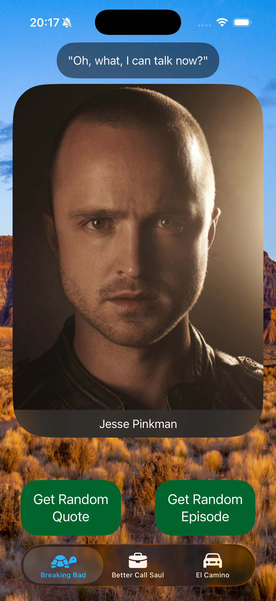
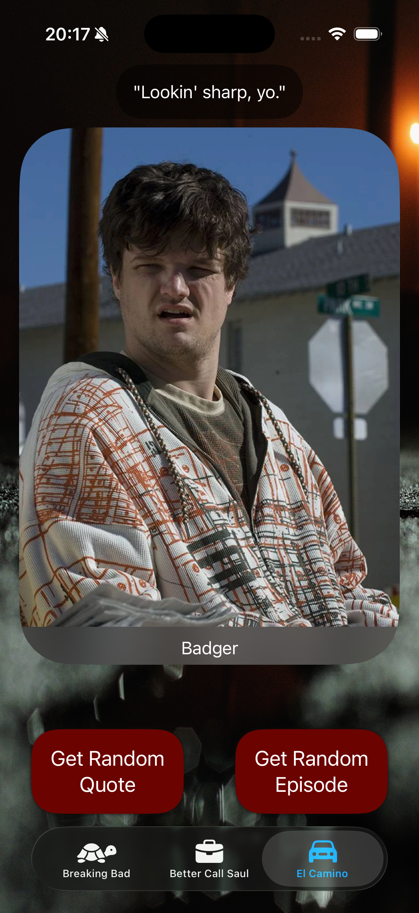
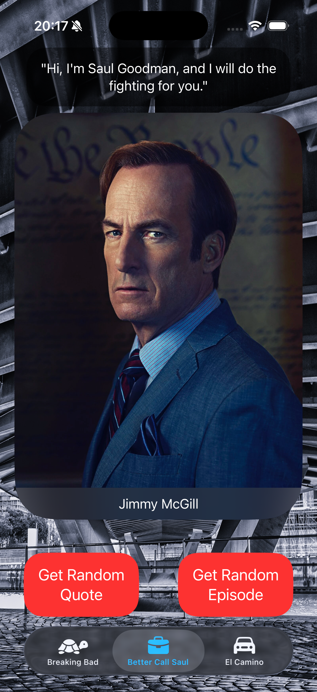
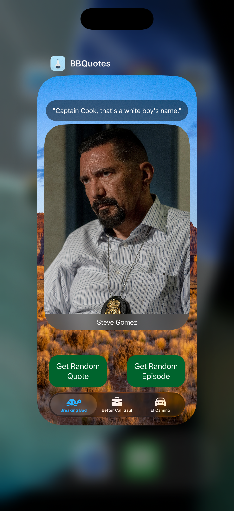
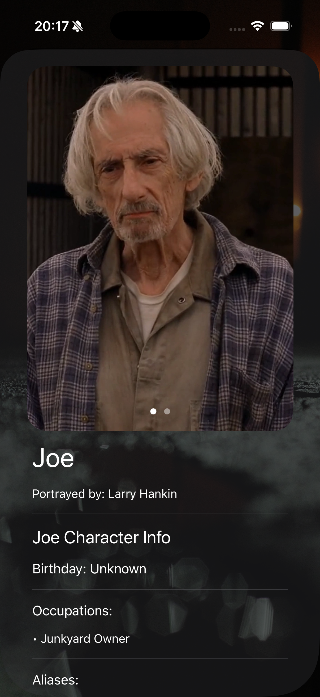
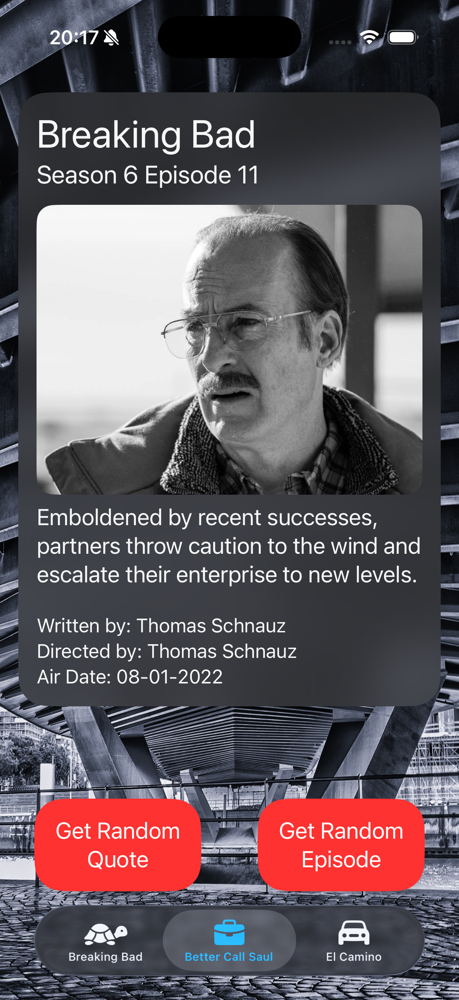
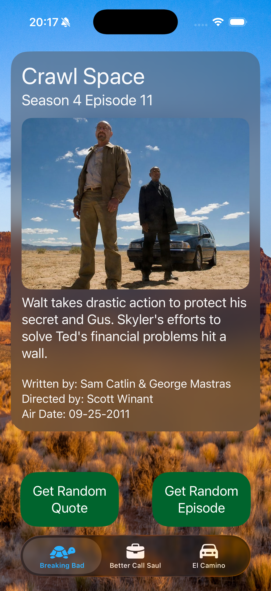
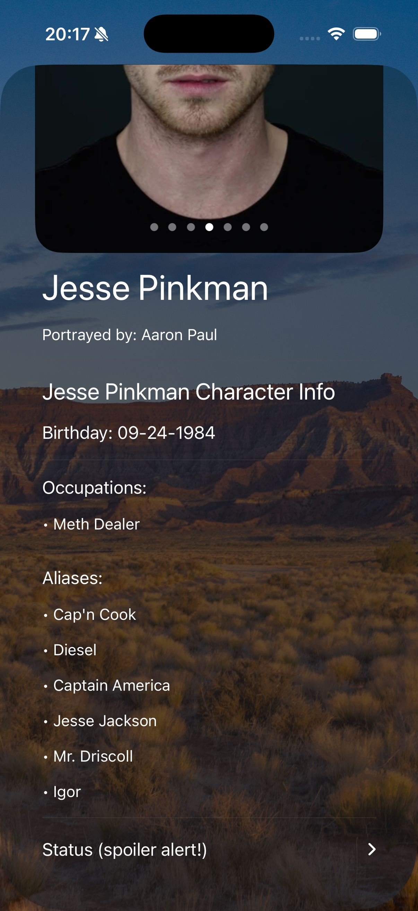

# Breaking Bad Quotes 📱

[](https://swift.org)
[](https://apple.com/ios)

This is a Breaking Bad Quotes based on loved series, is a project that contains all quotes listed at Breaking Bad Series, Better Call Saul and El Camino.

## 📸 Screenshots

### Highlights
| Main Screen | TabView | Random Quotes |
|:---:|:---:|:---:|
|  |   |  |

### Complete Gallery
Here you can see the app in action:

<p align="left">
  
  
  
  
</p>

> [!TIP]
> <p align="left">
> </p>

## ✨ Features

- [x] Quotes & Episodes Database: A complete collection of iconic quotes and detailed episode information from the Breaking Bad universe.
- [x] Spoiler Protection: Smart content management that allows users to toggle or manage spoiler-heavy information for a safe browsing experience.
- [x] Tab-Based Navigation: A clean and intuitive user interface using TabView for seamless switching between Quotes, Episodes, and Settings.
- [x] Interactive UI: Dynamic layouts built with SwiftUI, featuring character-specific details and episode summaries.

## 🛠 Technologies and Tools

- **Language:** Swift 6.0
- **Interface:** SwiftUI
- **Framework:** Foundation, SwiftUI
- **Architeture:** MVVM + Model Container
- **UI Components:** TabView, Sheets & NavigationStack, List & LazyVStack

## 🚀 How to run the project

1. Clone Repository CoreData:
   ```bash
   git clone https://github.com/keykenzo/BreakingBadQuotes.git
